# Socializing Kafka Events through AsyncAPI using IBM Event Endpoint Management, Confluent, and IBM API Connect


[Return to main APIC lab page](../ReadMe.md#lab-abstracts)

---

# Table of Contents
- [1. Introduction](#introduction)
- [2. Confluent Kafka](#confluent)
- [3. IBM Event Endpoint Management (EEM)](#eem-section)
    * [3a. Event Endpoint Management - Console](#eem-console)
    * [3b. Event Endpoint Management - Topics](#topics)
    * [3c. Event Endpoint Management - Virtual Topics](#virtual-topics)
    * [3d. Event Endpoint Management - Catalogs](#catalogs)
- [4. IBM API Connect](#apiconnect)
    * [4a. API Connect Manager](#apiconnect-manager)
    * [4b. API Connect Developer Portal](#apiconnect-devptl)
- [5. Consuming Flight Landing Events](#consume-flight-events)
    * [5a. Capture Event Gateway Certificates](#generate-egw-cert)
    * [5b. kafka-console-consumer.sh - Consume flight events](#kafka-console-consumer.sh)
    * [5c. Java Application -- Consume flight events](#java-consume)
- [6. Summary](#summary)

---


<br>

# 1. Introduction <a name="introduction"></a>

In this lab, you will explore the full potential of ASYNCAPI within IBM
Event Endpoint Management and IBM API Connect. ASYNCAPI enables the integration
of Kafka Topics into APIs via IBM Event Endpoint Management (EEM) and IBM API Connect. <br>

This lab will utilize a Kafka Topic named FLIGHT.LANDINGS, which is
established within Confluent Kafka cluster. Flight landing
events are produced in this topic each time a flight lands at an
airport. <br>

This lab will provide guidance on how to articulate and publish the
FLIGHT.LANDINGS topic into EEM, followed by making the API available on the IBM API Connect Developer Portal, enabling users to subscribe to and utilize events through Kafka Clients. <br>

Reference architecture diagram below;

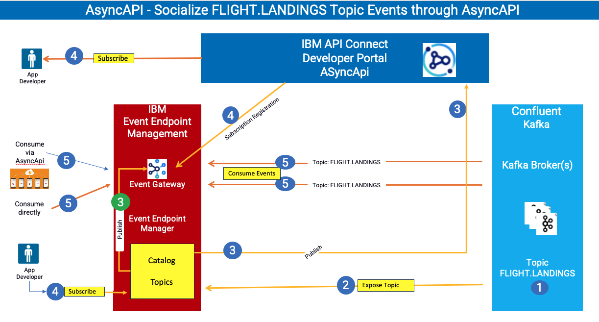


**What is Confluent Kafka** <br>
- IBM Confluent Kafka  is an event streaming platform built on open source [Apache Kafka](https://www.ibm.com/think/topics/apache-kafka)®. It is available both as a fully managed service or on-premise.

<br>

**What is IBM Event Endpoint Management?** <br>
- IBM Event Endpoint Manager (EEM) enables organizations to efficiently manage, discover, and share event streams in a manner comparable to APIs. EEM facilitates the addition and management of Kafka Topics from any Kafka platforms thereby offering a unified platform for managing Kafka Platforms. <br>

- **Event Endpoint Management Core Capabilities** <br>
**Event Catalog:** Provides a self-service, developer-friendly portal to search, discover, and reuse event sources.<br>
**AsyncAPI Standardization:** Automatically documents event streams using the standard AsyncAPI specification.<br>
**Centralized Control Plane:** Unifies governance across multiple disparate Kafka clusters.

- **Main Components** <br>
**Event Manager:** The administrative plane where technical experts discover Kafka topics, define access rules, and publish definitions to the catalog. <br>
**Event Gateway:** The runtime enforcement point that abstracts direct access to Kafka clusters, handling security, traffic virtualization, and policy enforcement.

- **Key Security and Governance Features** <br>
**Authentication:** Validates Kafka clients before granting access. <br>
**Quota Enforcement:** Limits the number of events a client can publish or consume over time.<br>
**Redaction and Filtering:** Automatically redacts sensitive information and enforces schema-based filtering as traffic flows through the gateway.

<br>

**What is IBM API Connect?** <br>
- IBM API Connect is an enterprise-grade, integrated API management platform that helps businesses create, secure, manage, share, monetize, and analyze application programming interfaces (APIs) across cloud and on-premises environments. <br>

<br>

**About this hands-on lab** <br>
- To support the hands-on activities in this lab, a dedicated environment
has been provisioned, consisting of a Red Hat OpenShift cluster and a
Linux workstation.

- **Red Hat OpenShift Cluster**\
    The OpenShift cluster serves as the container deployment platform for all IBM
    Capabilities throughout the lab.

- **Linux Workstation**\
    The Linux workstation functions as the primary interface for
    interacting with the OpenShift cluster. 

You will be performing this lab from the Desktop provided by your instructor. <br>

Logon to the Desktop as ibmuser / engageibm. <br>

<br>

# 2. Confluent Kafka <a name="confluent"></a>

**THIS SECTIONS is REVIEW ONLY**

The instructor will take care of Confluent setup. <br>

Confluent Console: https://163.66.92.248/home <br>
User: admin <br>
Password: ssx1JrsQt5YJhRFVJSjM98QW <br>
<br>
Once login explore FLIGHT.LANDINGS topic events. <br>

Notice that the flight landing events are being generated into Confluent Kafka platform. There is a App Connect Enterprise message flow that is simulating the events. <br>

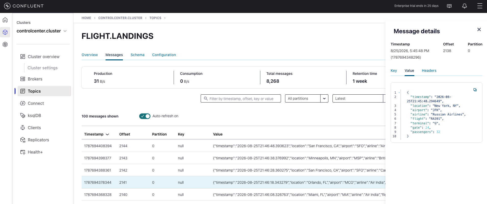

<br>


# 3. IBM Event Endpoint Management (EEM) <a name="eem-section"></a>

**This section is showing the screens that an Event Endpoint Management Admin would use to expose a topic as AsyncAPI for IBM API Connect.**
<br>

## 3a. Event Endpoint Management - Console <a name="eem-console"></a>

**THIS SECTIONS is REVIEW ONLY**

Let us examine the FLIGHT.LANDINGS Kafka Topic, which has already been pre-defined and cataloged in EEM.

Access IBM Event Endpoint Manager (***my-eem-manager***) from the Cloud Pak for Integration Platform Navigator Console.

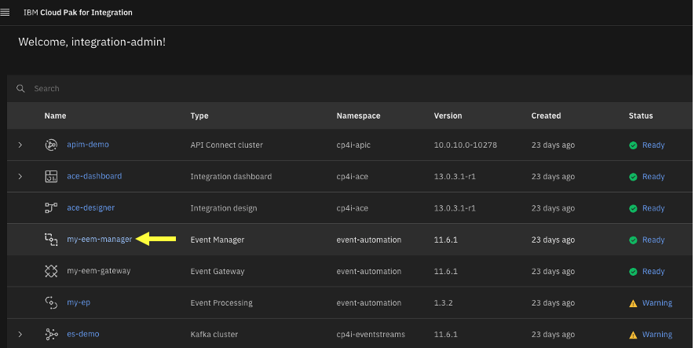

Logon to IBM Event Endpoint Manager as an Admin user "eem-admin", and password "passw0rd".

If you get the below Welcome page, then simply click on the **Skip**
button to view the Topics view.


## 3b. Event Endpoint Management - Topics<a name="topics"></a>

**THIS SECTIONS is REVIEW ONLY** <br>


Click on the FLIGHT.LANDINGS to look at the options for the topic. Here
you will see that it has been published to the Event Gateway.

Please be informed that the FLIGHT.LANDINGS Topic from the Kafka Platform (Confluent or Other Kafka providers) 
is preconfigured within EEM, and an application is consistently generating flight landing events into this Topic at regular intervals.


Explore the **Information** tab. Notice the Schema, and Sample message
that is describing the FLIGHT.LANDINGS topic.


## 3c. Event Endpoint Management - Virtual topics <a name="virtual-topics"></a>

**DO THIS SECTION** <br>

Let's create a virtual topic with your student id, for example STUDENT1.FLIGHT.LANDINGS. <br>

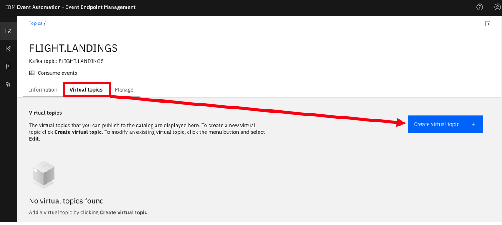


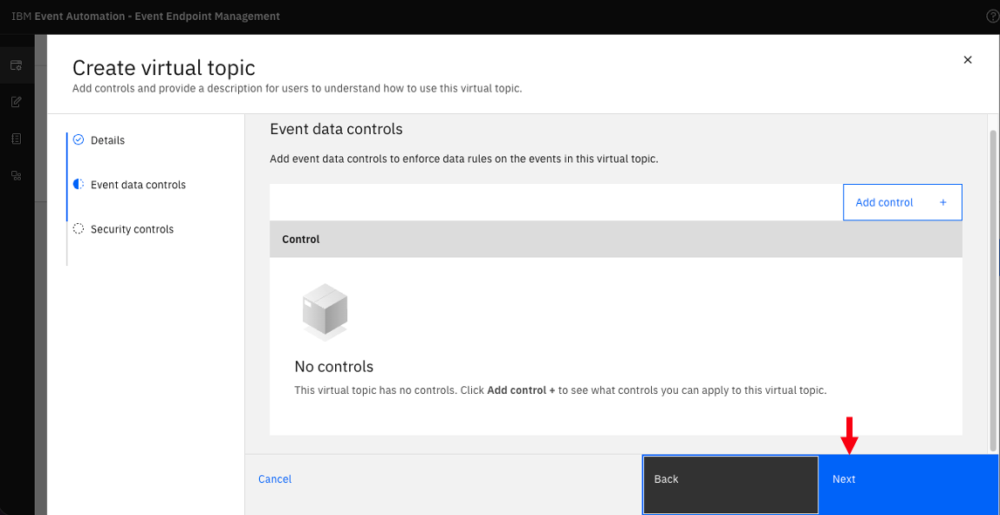


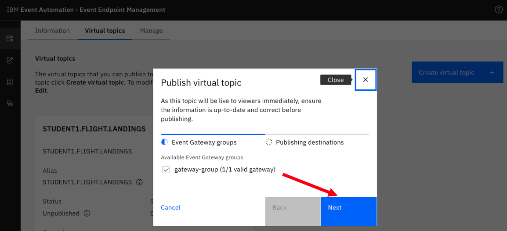

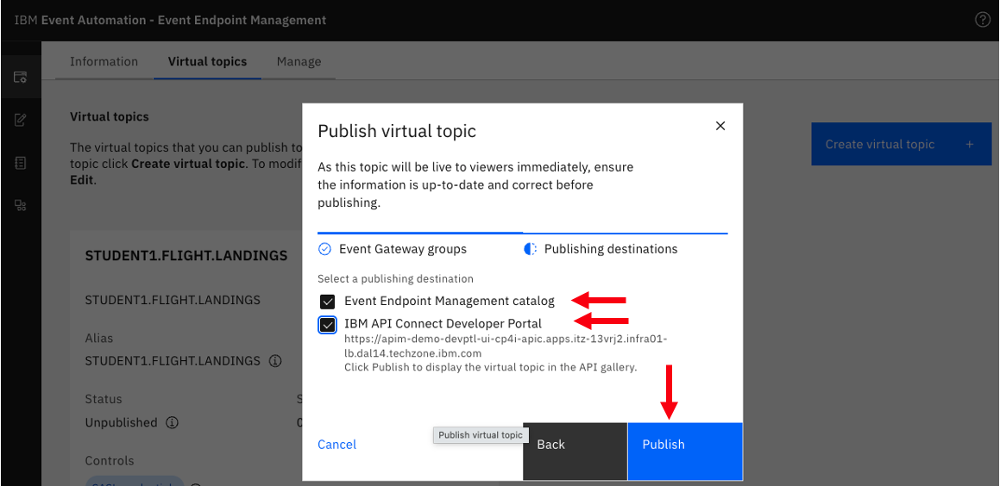

After Publish, it should look like below. <br>

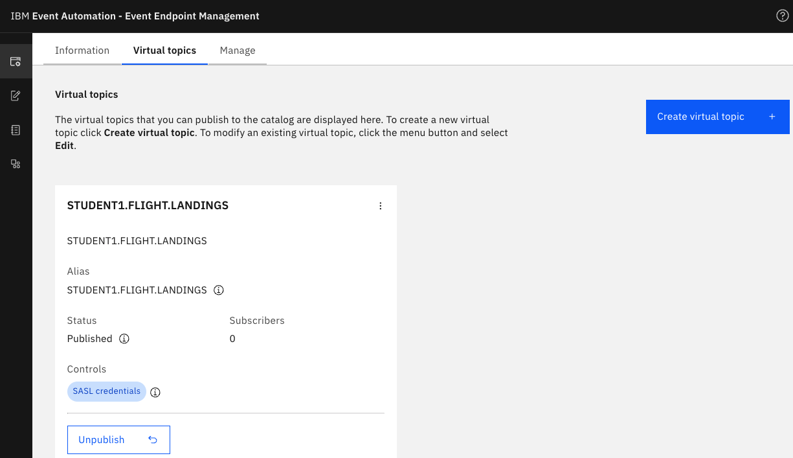


## 3d. Event Endpoint Management - Catalogs<a name="catalogs"></a>

Now, click on the Catalog icon on the left to see the Published Topics
to the Event Gateway.


Click on FLIGHT.LANDINGS topic, and you should see your virtual topic for example STUDENT1.FLIGHT.LANDINGS. Explore the page. <br>

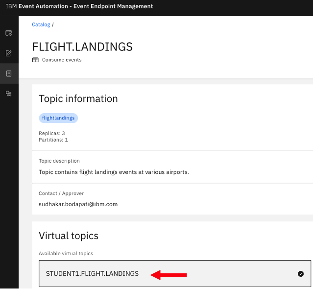

<br>


# 4. IBM API Connect <a name="apiconnect"></a>

Here, you will access, login, discover, and subscribe to the FLIGHT.LANDINGS AsyncAPI.
Consider the API Connect Developer Portal as a marketplace for all your
APIs, enabling application development teams to discover, subscribe to,
and utilize the APIs within their applications, including Web
Applications, Mobile Applications, and more.

## 4a. API Connect Manager<a name="apiconnect-manager"></a>

a) Logon to API Connect Manager using your student id. <br>  

From the Cloud Pak for Integration Platform Navigator Console, access IBM API Connect Manager (apim-demo) <br>

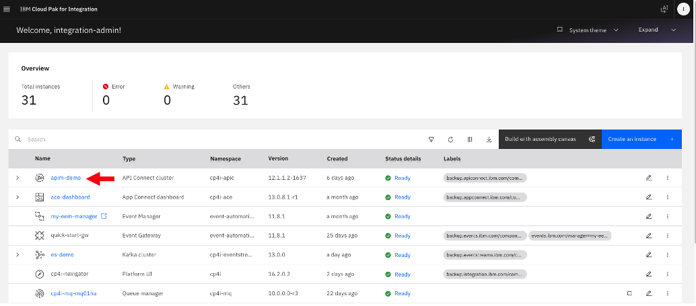

b) Click on Manage. <br>


c) Click on Sandbox catalog <br>


d) Click on Catalog Settings, and Portal. <br>


e) Click on the Portal endpoint URL. <br>

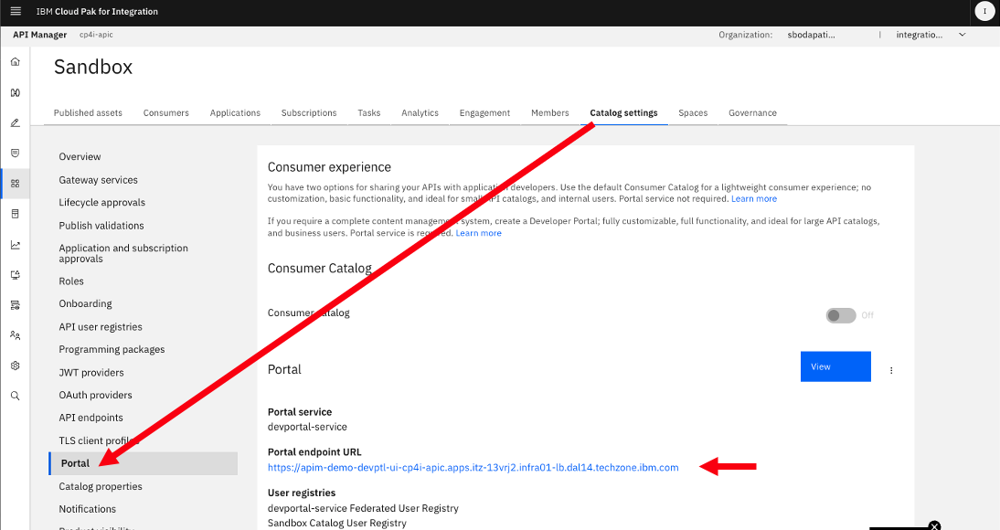


## 4b. API Connect Developer Portal<a name="apiconnect-devptl"></a>

Welcome to IBM API Connect Developer Portal. Now, click "Sign up" if you **not already** signed up with your student id, otherwise use your student Developer Portal Credentials and login.<br>

**Sign up process** <br>


Enter id, email, and password. <br>


**Sign-in** now. <br>
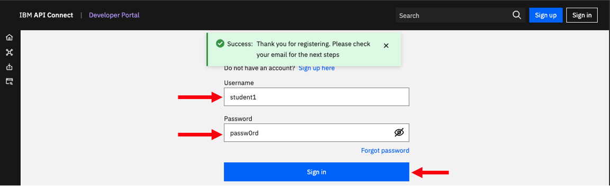

Welcome to developer portal home page. <br>
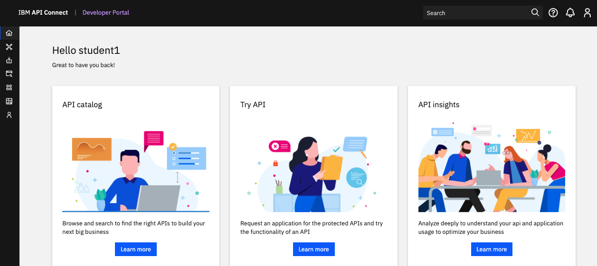

Click on "Asset Gallery". <br>
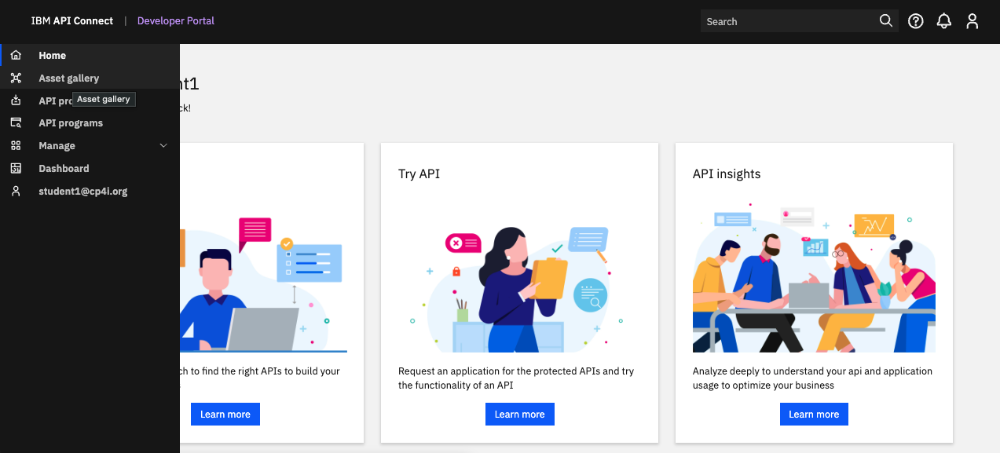

You should see the Virtual Topic that you created and published in the Event Endpoint Manager section. <br>


Click on your Virtual Topic AsyncAPI tile (ex: STUDENT1.FLIGHT.LANDINGS). Now click on \<Consume\> icon so that you can subscribe and consume the events.<br>


Select "Create new application", then click \<Request\>. <br>
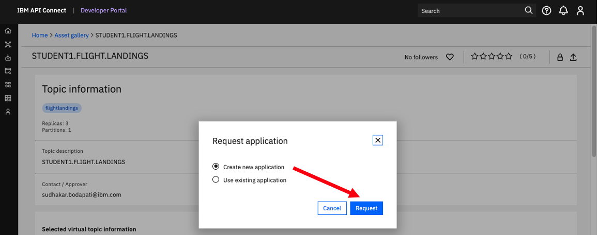

Give a name to your application, for example **student1-asyncapi-demo**. <br>
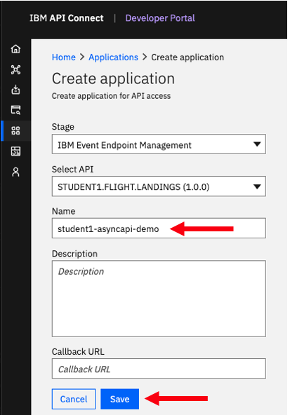


Now, click on the application to see the SASL username and password. <br>

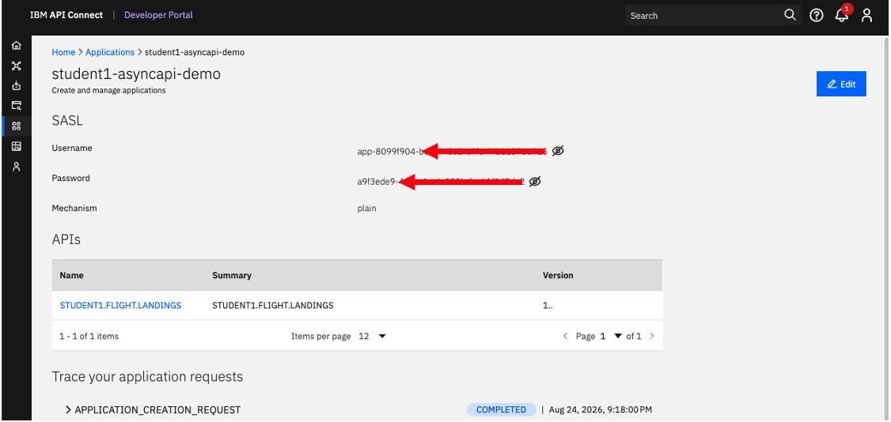

Let's capture the SASL Username, and Password, follow the below steps. <br>

Now, on the Desktop open a Terminal Window. <br>

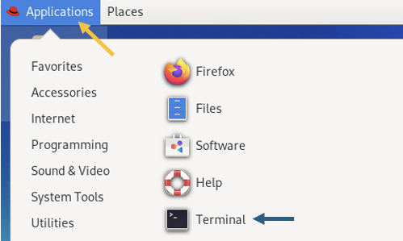

Go to the EEM directory

```
cd ~/EEM

gedit config.properties
```

```
STUDENT_NUM=REPLACE_WITH_YOUR-STUDENT-NUMBER (for example 1)
APP_CLIENT_ID=REPLACE_WITH_SASL_USERNAME_FROM_ABOVE
APP_CLIENT_SECRET=REPLACE_WITH_SASL_PASSWORD_FROM_ABOVE
```

Click on the AsyncAPI (Ex: STUDENT1.FLIGHT.LANDINGS). <br>


Let's capture the gateway-group. <br>

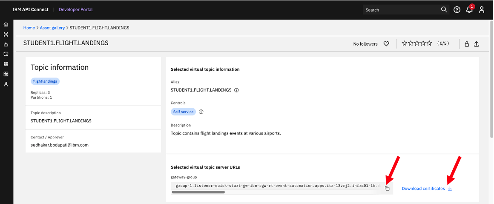

Copy the "gateway-group", and set EGW_BOOTSTRAP in  \~/EEM/config.properties file. <br>

```
STUDENT_NUM=1
APP_CLIENT_ID=app-xxxxx-xxxx-xxxx
APP_CLIENT_SECRET=a9fxxxxxxxxxxxxxxxxxx
EGW_BOOTSTRAP=REPLACE_WITH_GATEWAY_GROUP
```
Now, save and close config.properties file. <br>

<!--
Click on \<Download certificate\>. The certificate will be downloaded into ~/Downloads folder. <br>
-->

<br>


# 5. Consuming Flight Landing Events<a name="consume-flight-events"></a>

In this section, you will consume the flight landing events using Kafka Clients **kafka-console-consumer.sh** and a **java_flight_landing_consumer.sh** client programs.

## 5a. Capture Event Gateway Certificates<a name="generate-egw-cert"></a>

**Note:** Ensure you are logged into the OpenShift cluster in the Terminal before proceeding - you can do so by accessing OpenShift console, then, copy the login command (top right corner > hover over ‘student(n)’ > copy login command) to your clipboard and use it to log into your terminal. <br>

Run the generate_egw_cert.sh script.

```
./generate_egw_cert.sh
```

When script is done run **ls -ltr** of the directory and you should see the egw cert files

```
ls -ltr
```


## 5b. kafka-console-consumer.sh - Consume flight events <a name="kafka-console-consumer.sh"></a>

Here, you will receive flight landing events using the open-source kafka-console-consumer.sh program.

Change Directory to \~/EEM.

```
 cd ~/EEM
```

```
gedit kafka_console_flight_landings_consumer.sh
```
Update topic name (last line) to STUDENTyour-number.FLIGHT.LANDINGS, save and close file. <br>

You should have the following info saved in your **config.properties** file.

```
cat config.properties
```

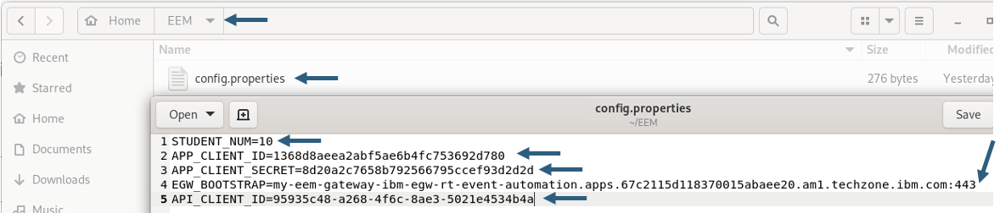


Now run the kafka_console_flight_landings_consumer.sh script and you should see flight landings events. <br>

```
 ./kafka_console_flight_landings_consumer.sh
```

 

<br>

## 5c. Java Application -- Consume flight events <a name="java-consume"></a>

Here, you will receive flight landing events using a custom java program.

Open a **NEW** Terminal window (keep the kafka_console_flight_landing_consumer.sh running).

```
cd ~/EEM/java_flight_landing_project

gedit config.properties.2
```
Update TOPIC to STUDENTyour-number.FLIGHT.LANDINGS. <br>

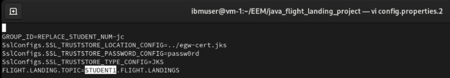

Now, run the Java consumer program. <br>
```
./java_flight_landing_consumer.sh
```

You should see output like below.

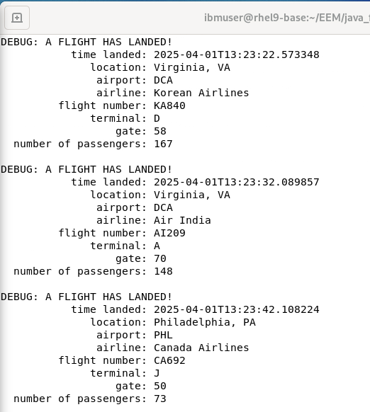

When both the Consumers are running, you should see both the Consumers receiving the events.<br>

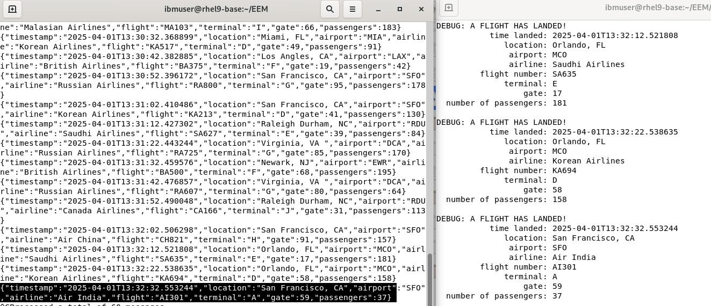

You have initiated two Kafka Clients and have successfully obtained
Flight landing events from Kafka via the IBM Event Gateway, with both clients receiving identical data.<br><br>


# 6. Summary <a name="summary"></a>

In this laboratory, you have examined the AsyncAPI of IBM Event Endpoint Management and IBM API Connect platforms to transform Kafka Topics into APIs, enabling secure consumption of Kafka stream data via IBM Event Gateway.

**!!! CONGRATULATIONS !!!**

[Return to main APIC lab page](../ReadMe.md#lab-abstracts)

<br>

# 7. PreWork <a name="prework"></a>

LAB INSTRUCTOR PreWork. <br>

Environments: <br>

Techzone Collection for Confluent: https://techzone.ibm.com/collection/confluent-platform-environments/environments <br>
Env Name: Confluent Platform Enterprise Software

Techzone RHEL Desktop: 
https://techzone.ibm.com/collection/integration-application-modernization-pots/environments?platform=69d16bc98a606868ad154e31
<br>

Flight Landings Simulator to ACE. <br>
GitRepo: https://github.com/ibm-cloudintegration/CP4I-PoT-Public/tree/main/AppConnect/flight-landing-simulator-confluent
<br>

```

EVENT ENDPOINT MANAGEMENT. - API CONNECT INTEGRATION

First login to DEV Portal as user administrator .
Password can get using the command below.

oc get secret apim-demo--dceadcab-admin-secret -n cp4i-apic -o jsonpath='{.data.password}' | base64 -d

After logging into the dev portal as administrator, create user dpadmin, passw0rd.

— now create secret in event-automation
oc create secret generic devportal-api-secret --from-literal="apim-key”=“dpadmin:passw0rd” -n event-automation 


— Get apim-demo-mgmt-devportal-admin-client secret from cp4i-apic then create devportal-ca secret in event-automation

kubectl get secret apim-demo-mgmt-devportal-admin-client -n cp4i-apic -o json \
  | jq 'del(.metadata.annotations, .metadata.labels, .metadata.creationTimestamp, .metadata.resourceVersion, .metadata.uid) | .metadata.namespace = "event-automation" | .metadata.name = "devportal-ca"' \
  | kubectl apply -f -
```