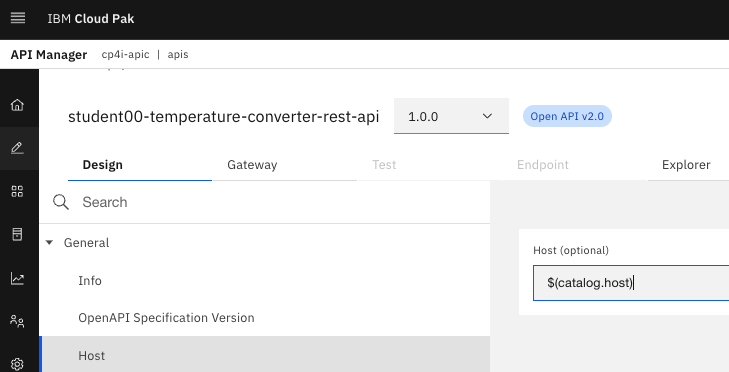
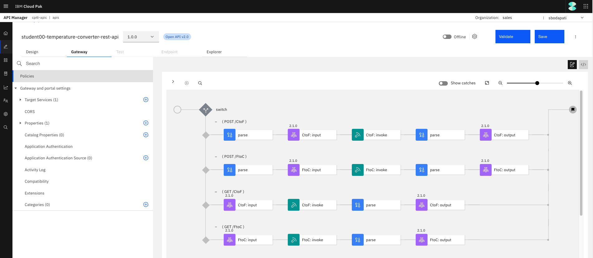
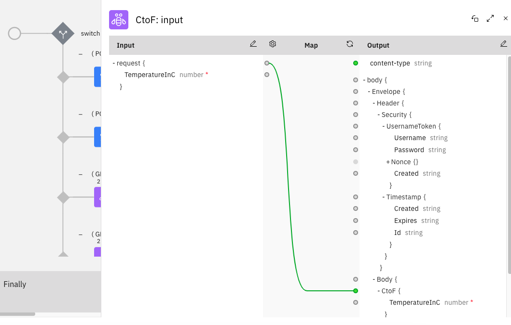
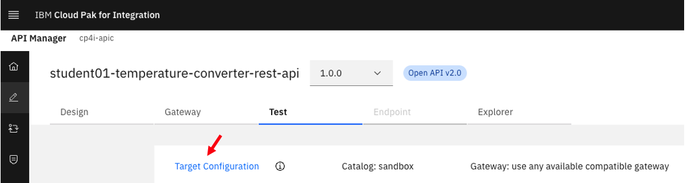
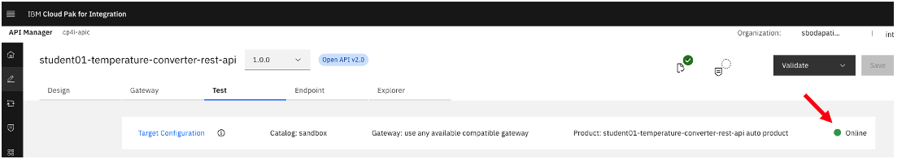
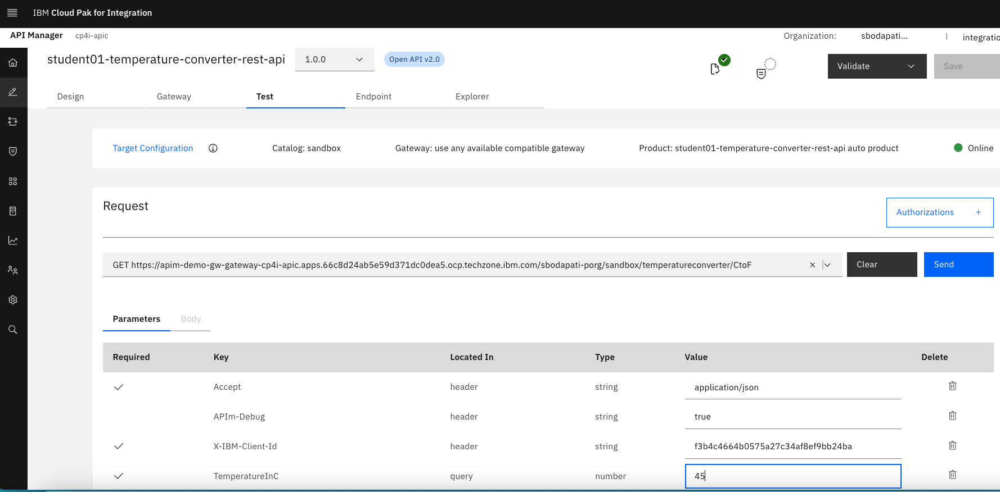

# Creating REST Proxy based upon a WSDL

# 1. Overview

In this lab, you will configure a SOAP WebService that is deployed to IBM App Connect to function as a REST Proxy within IBM API Connect. You will be deploying a very simple Temperature Converter WebService into IBM App Connect then expose it to IBM API Connect as a REST API.  <br>

<b> Design diagram </b>
<br>

<br>

# 2. App Connect - Deploy Temperature Converter WebService

Download the bar file from [<b><u>here</u></b>](./src/TemperatureConverter.bar).

Deploy the bar file.<br>

Logon to Cloud Pak for Integration Platform Navigator, open App Connect Dashboard > Click on "Deploy Integrations" tile.<br>


Select "Quick Start Integration", and Click \<Next\>. <br>

Drag & drop the bar file downloaded above as below.<br>


Click \<Next\> two times. <br>

Name your Integration Runtime as \"ace-tk-temperature-converter\". <br>


Click \<Create\>. <br>

Wait for 30seconds and refresh the page. <br>

Make sure the Integration Runtime \"ace-tk-temperature-converter\" is Ready. <br>

Click on the Integration Runtime \"ace-tk-temperature-converter\" tile.<br>


Click on the Properties tab, and copy "SOAP HTTP URL". This will be configured in the next section (API Creation).<br>


<br>


# 3. Api Connect - Create REST Proxy from the WSDL

Download the zip file that contains Temperature Converter WSDL, and XSD's from [<b><u>here</u></b>](./src/TemperatureConverter_WSDL.zip).

Logon to Cloud Pak for Integration, and open API Management (apim-demo). <br>

Click on "API Studio" icon.<br>


Click on "New API Project > Create a new project".<br>


Enter **"Project name"** as **"student(n)-soap-project"**, and  "Description" as **"TemperatureConverter - SOAP to REST".** <br>


## 3a. Add API 

Click on the project you just created. <br>


Click on **"Add API"**. <br>


Select **SOAP**. <br>


Drag and drop the zip file that you downloaded above. <br>


Enter **API Name** as **student1-temperature-converter-rest-api**, then click **\<Create\>**. <br>


Copy the highlighted **path** value (Control+c). We need update this value in the two yml files highlighed below.<br> 


Notice that it's missing part of the zip file. **its a bug, will be fixed**<br>


Paste here. <br>


Similarly, update next **yml** file as below. <br>


Click on the **Design** view. <br>


## 3b. Publish API 

Click **Publish**. <br>


Click \<Next\> in the bottom right of of the screen. <br>


Click \<Publish\> in the bottom right of of the screen. <br>


If Publish is successful, then click on **Catalog**. <br>


Click \<Catalog settings\> tab, then click on **Portal**.<br>


<br>
xxxxxxxx
<br>


Click on "Host", and blank out the value. <br>



Click on "Gateway" Tab. <br>



Watch how the API is orchestrated with parse, mapping, and Invoke nodes. Ciick on each node and see details (Example below).<br>



<br>
Now, complete the API design. <br><br>

Click on "Properties" on the left, and click (+) sign. Add target-url property, and paste "SOAP HTTP URL" captured in the previous seciton as below. <br>


Click \<Create\>. <br>

Now, click on "Policies" option on the left, and lets modify the API in the designer view.<br>

Click on each Node on the API Designer, see how the mapping is configured between REST to WSDL format. <br>
<br>
Now click on the first "CtoF Invoke" Node, and update the URL. <br>


Update URL value to "{target-url}" (without the double quotes). <br>

Similary, set the URL field on the other three Invoke Nodes to be same "{target-url}".<br>

SAVE the API (The Save button is on the top right of the screen). <br>

<br>

# 4. Testing the REST Proxy
Click on the "Test" tab.<br>


Click on "Test Configuration". <br>


Enable Auto-publish, and click "Save Preferences".<br>


Now, the API should be online.<br>



Select GET CtoF operation. <br>
Click "**Clear**" to display the Parameters.<br>


Enter 45 for TemperatureInC parameter below.<br>



You should get the response with the Converted Fahrenheit value as below.<br>


Check the "trace" tab of each Node as below.<br>


Also, check "trace" for each of the remaining nodes. <br>

**Optional test:** You can also try POST CtoF operation and enter below in the Body tab. <br>
```
{
    "TemperatureInC": 30
}
```
<br><br><br>

**Similary, test FtoC method.**
<br>
```
Enter sample JSON in the Body.
{
    "TemperatureInF": 32
}
```
### Congratulations!!!


