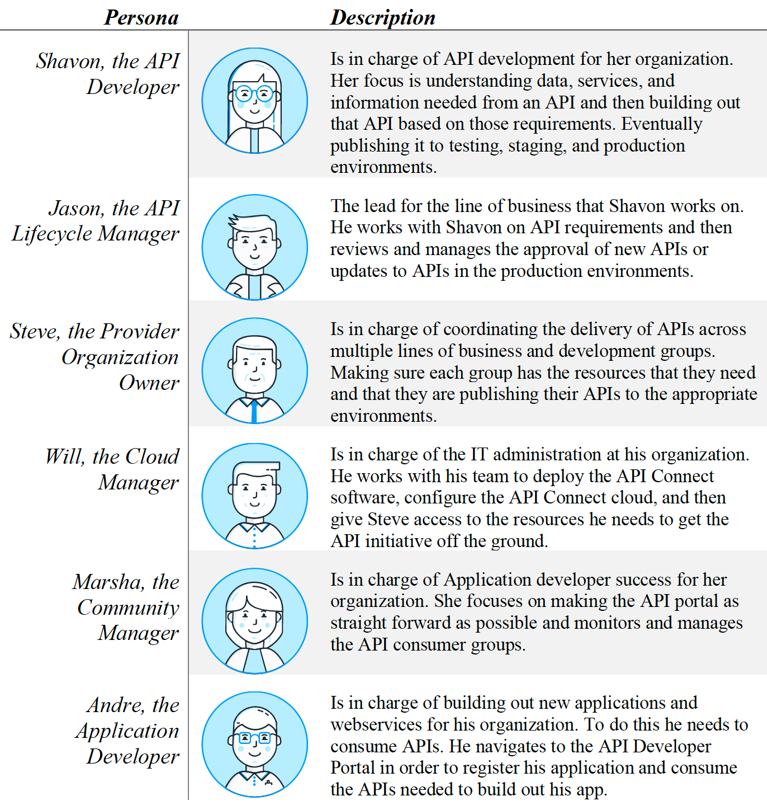

# IBM API Connect

## Introduction
IBM API Connect is an integrated API management offering, with capabilities and tooling for all phases of the API lifecycle. Key steps of the API lifecycle include create, secure, manage, socialize, and analyze.

[Return to main lab section](../index.md#lab-section)

These lab exercises will walk you through designing, publishing, and securing APIs.

IBM API Connect has several out of the box personas. Some of these personas will be used in the context of these labs.  The [IBM API Connect V10.x Deployment WhitePaper](https://community.ibm.com/HigherLogic/System/DownloadDocumentFile.ashx?DocumentFileKey=21e9c4e0-f733-c7b1-3267-b1a604ebb0e1&forceDialog=0) has more detail.

**Personas in IBM API Connect**:

[Return to main lab section](../index.md#lab-section)

## Lab Abstracts

|  Subject                            | Description                                            |                                                               
|-------------------------|------------------------------------------------------------------------------------------------------------|
| [Create and Secure an API with DataPower API Gateway](Create-Secure-Publish-DPAPIGW/ReadMe.md)       | **Create, Secure, Publish API to DataPower API Gateway.** In this lab, you will get a chance to use the IBM API Connect Studio and its intuitive interface to create a new API using the OpenAPI definition (YAML) of the existing Customer Database RESTful service.  **Prequisite:** None.  **Primary persona**:  Shavon (API Developer)
|-------------------------|------------------------------------------------------------------------------------------------------------|
| [Create and Secure an API with DataPower Nano Gateway](Create-Secure-Publish-DPNGW/ReadMe.md)       | **Create, Secure, Publish API to DataPower Nano Gateway.** In this lab, you will get a chance to use the IBM API Connect Studio and its intuitive interface to create a new API using the OpenAPI definition (YAML) of the existing Customer Database RESTful service.  **Prequisite:** None.  **Primary persona**:  Shavon (API Developer)
|-------------------------|------------------------------------------------------------------------------------------------------------|
| [Expose Kafka Topic as AsyncAPI](AsyncAPI/Readme.md)       | **Integration with AsyncAPI's Event Endpoint Experience**  Here you will explore the full potential of ASYNCAPI within IBM Event Automation and IBM API Connect. ASYNCAPI enables the integration of Kafka Topics into APIs via IBM Event Endpoint Management (EEM), which is a feature of IBM Event Automation, as well as IBM API Connect.
|-------------------------|------------------------------------------------------------------------------------------------------------|
| [OAuth Security and Version your API](OAuth-Versioning/ReadMe.md)       | **Add OAuth Security to your API and use Lifecycle Controls to Version Your API:**  In this lab, we will secure the Customer Database API that was created in the "Create and Secure an API to Proxy an Existing REST Web Service" lab to protect the resources exposed by IBM API Connect. Consumers of our API will be required to obtain and provide a valid OAuth token before they can invoke the Customer Database API.  In order for the changes to take effect, we must publish the APIs to the developer portal and make them available for the API Consumers.  **Prequisite:** "Developer Portal Experience" lab.  **Primary personas**:  Shavon (API Developer) and Jason (API Lifecycle Manager)
|-------------------------|------------------------------------------------------------------------------------------------------------|
| [GraphQL API](APICforGraphQL/ReadMe.md)       | **Creating a StepZen GraphQL API:** In this lab, we will leverage an existing REST API to create  GraphQL Proxy and then expose the GraphQL Proxy through IBM API Connect. By using GraphQL, one can Query for fields that they are interested in thus reducing the response payload and network traffic.   **Prequisite:** None.  **Primary personas**:  Shavon (API Developer) and Andre (Application Developer)
|-------------------------|------------------------------------------------------------------------------------------------------------|
| [Test APIs - using smartgenerator](TestAPIs-SmartGenerator/README.md)       | **Optional lab - Create test cases using Smart Generator:** In this lab, we will leverage IBM API Connect Test APIs capability to automatically generate testcases and run tests.  
|-------------------------|------------------------------------------------------------------------------------------------------------|

[Return to main lab section](../index.md#lab-section)
