# App Connect - Exposing Customer Database REST API as an MCP Server in IBM Bob

[Return to MQ lab page](../index.md)

---

# Table of Contents
- [1. Overview](#overview)
- [2. Signup to IBM Bob](#signup)
- [3. App Connect Dashboard](#ace-dashboard)
	* [3a. Deploy Customer Database REST API](#ace-dashboard-deploy-cdb)
	* [3b. Create MCP Server ](#ace-dashboard-create-mcp)
- [4. IBM Bob](#ibm-bob)
	* [4a. Add Customer Database MCP Server](#ibm-bob-add-mcp)
- [5. Sample Prompts](#prompts)
- [6. Summary](#summary)

---

## 1. Overview <a name="overview"></a>

In this lab, you will deploy Customer Database REST API into IBM App Connect on Cloud Pak for Integration, then you will create an Model Context Protocol (MCP) server in App Connect which will be used in IBM Bob. <br>
<br>

## 2. Signup to IBM Bob <a name="signup"></a>

Signup for IBM Bob 30-day free trial. <br>

https://bob.ibm.com/trial

<br>

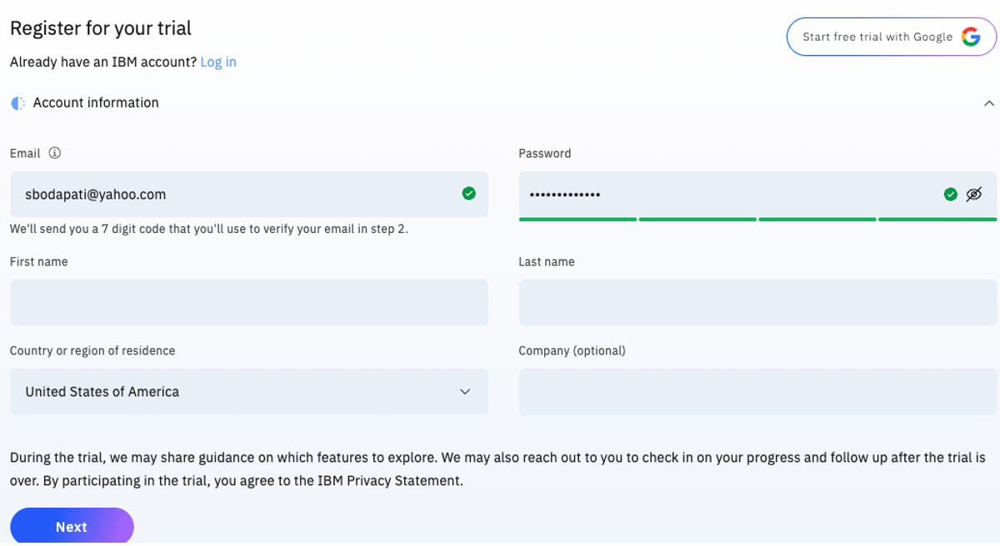


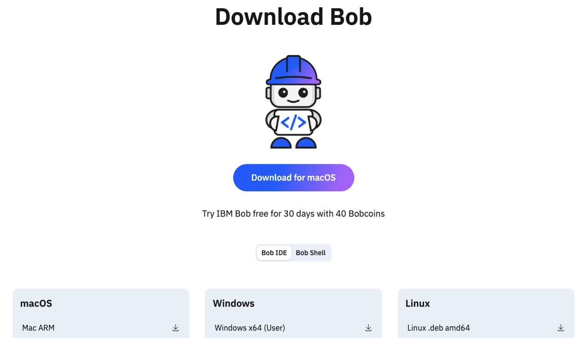


<br>


## 3. App Connect Dashboard <a name="ace-dashboard"></a>

### 3a. Deploy Customer Database REST API <a name="ace-dashboard-deploy-cdb"></a>

For this lab, we already have the REST service built and available as a **bar** file. You can download the **CustomerDatabaseV3.bar** file for the service [<u>**here**</u>](./resources/CustomerDatabaseV3.bar).
<br>

Open IBM App Connect Dashboard from the Cloud Pak for Integration Platform Navigator, and click on Deploy Integrations. <br>

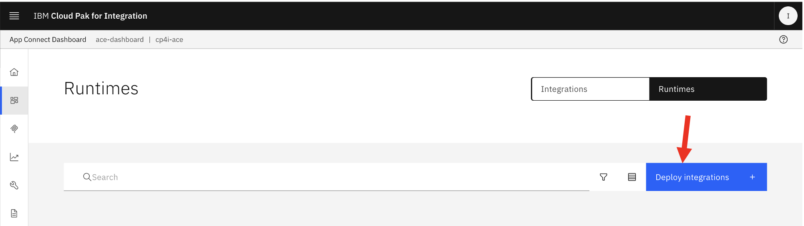

Click Quick Start , then click \<Next\>. <br>

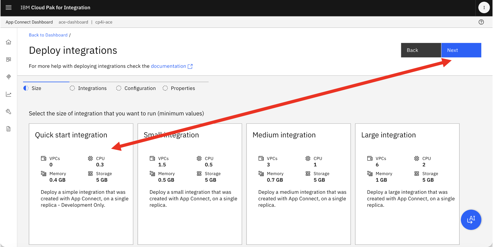


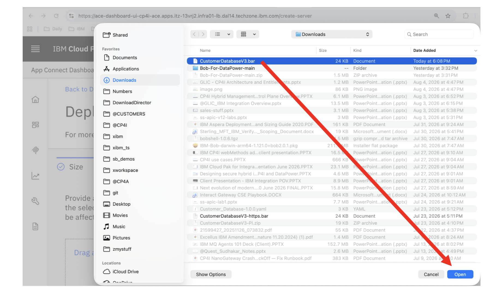

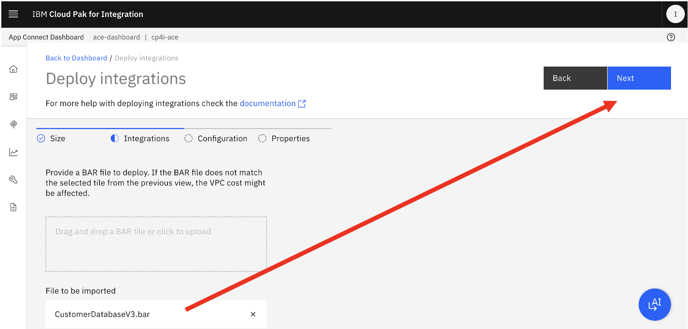


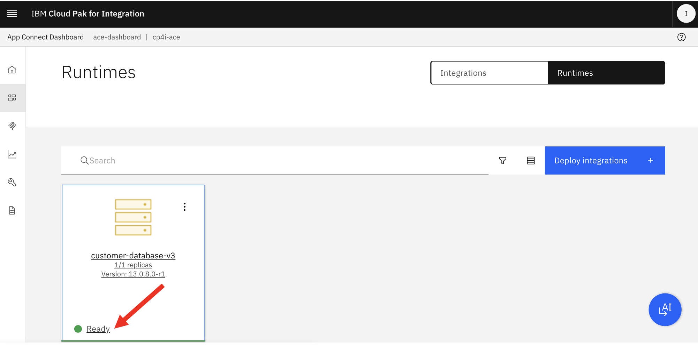

<br><br>

### 3b. Create MCP Server <a name="ace-dashboard-create-mcp"></a>


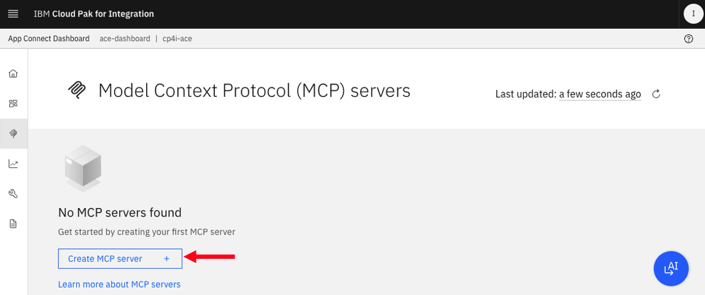

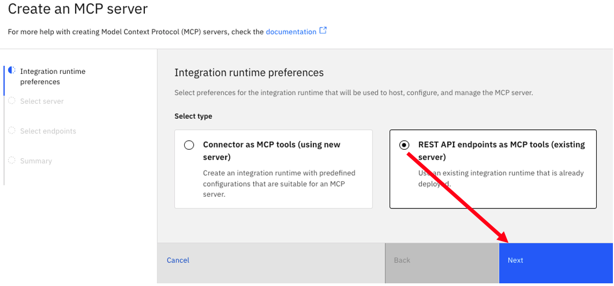


Capture MCP Server URL, and Basic Auth Credentials. <br>

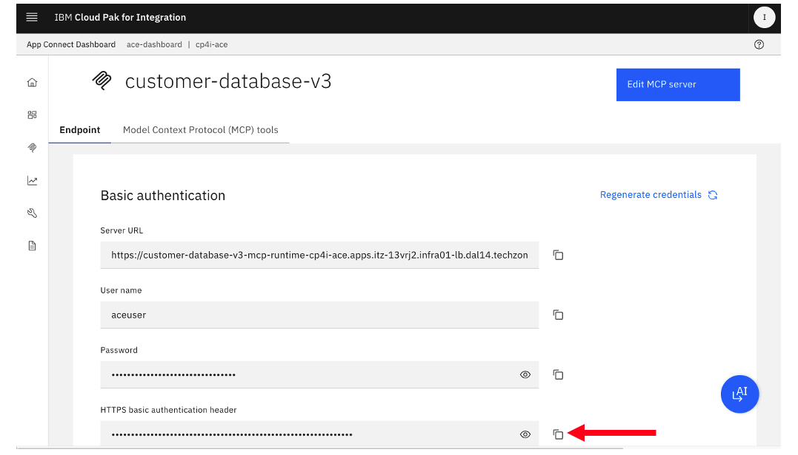
<br>


## 4. IBM Bob <a name="ibm-bob"></a>

Open the IBM Bob IDE, and navigate to Settings <br>

### 4a. Add Customer Database MCP Server <a name="ibm-bob-add-mcp"></a>

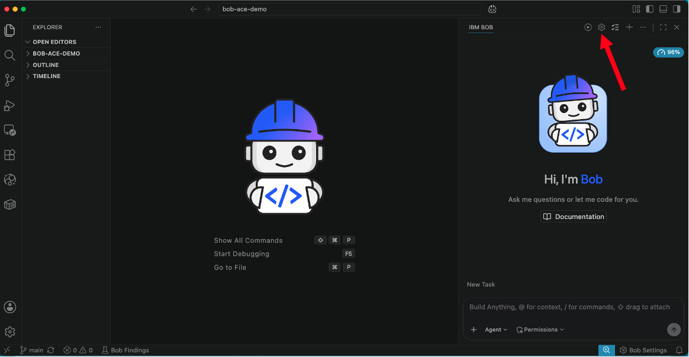

Navigate to MCP. <br>


Click + sign. <br>


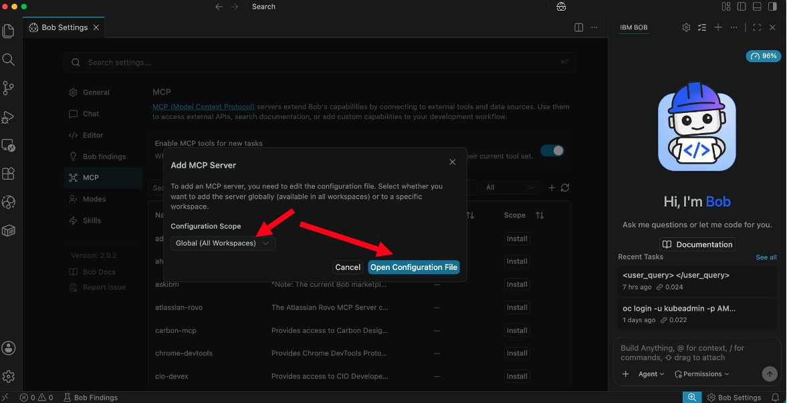

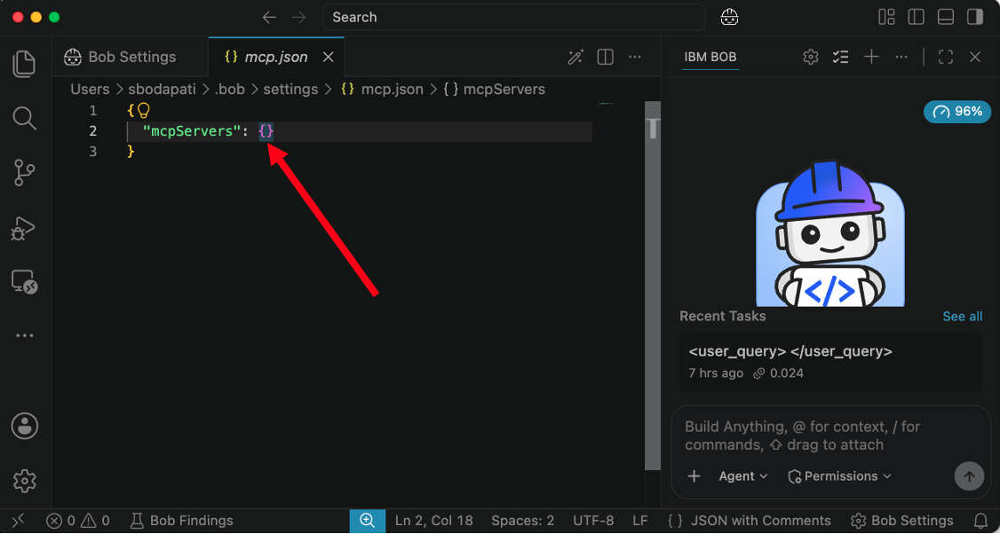
Append the below between the curly braces. <br>
```
    "customer-database-v3": {
        "url": "",
        "headers": {
            "Authorization": ""
        }
    }
```


Now, populate the url, and Authorization values from the MCP Server created in the App Connect Dashboard. <br>


Now, save and close mcp.json. <br>

Notice that customer-databasev-v3 is connected to the MCP server. <br>


## 5. Prompts <a name="prompts"></a>


Click on Approve. <br>


Notice that Bob called the backend MCP server and the REST API and retrived list of customers. <br>


Let's add few Customers using below prompt. <br>
```
add customer, firstname Joe, lastname Jodl, address 144 marina drive, edison, nj, zip code 11111-1111
```
Notice that Bob automatically formed the JSON payload for addCustomer operation. <br>
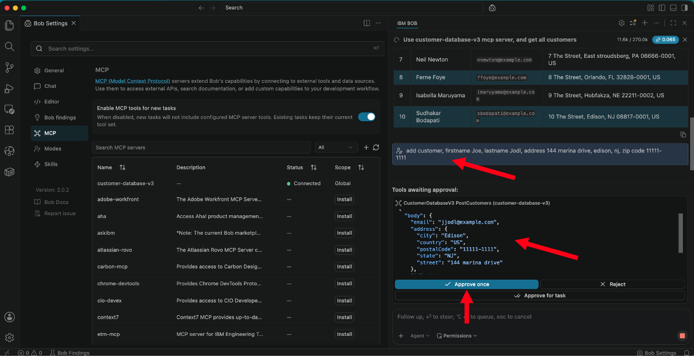

Click "Approve Once". <br>

Notice that Customer 11 was created Successfully.
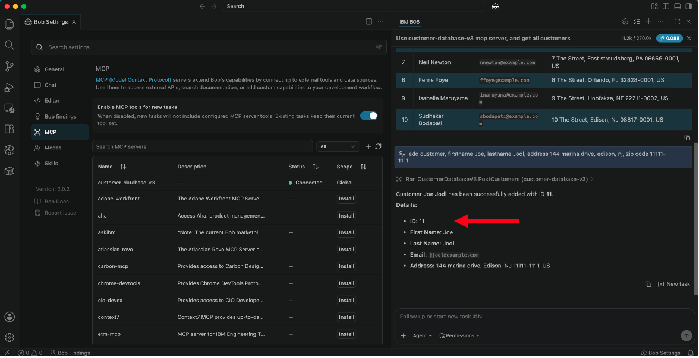

## 6. Summary <a name="summary"></a>

Congratulations! You have exposed an APP Connect REST API as an MCP server into IBM Bob, and ran prompts to retrieve and add new customers through Natural Language prompts using IBM Bob. <br>
<br>

[Return to ACE lab page](../index.md)