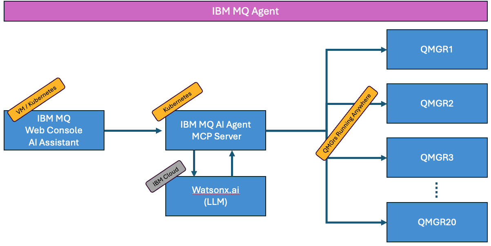
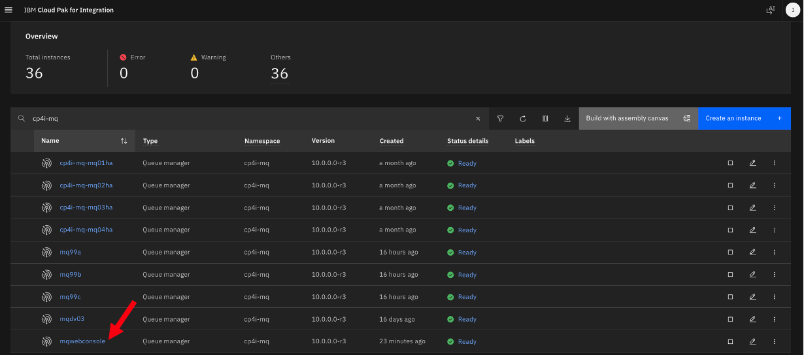
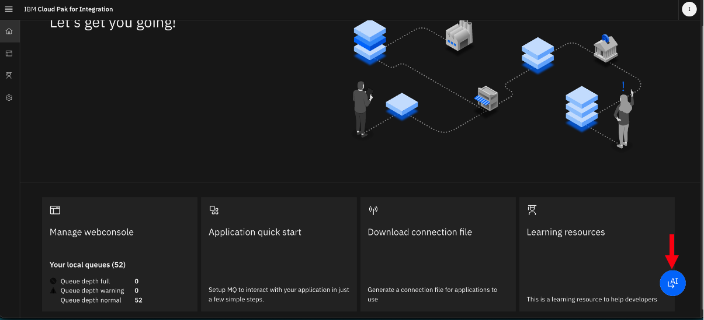
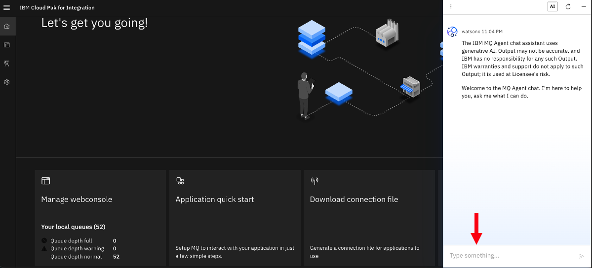
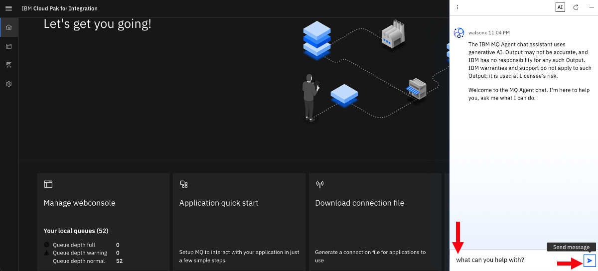
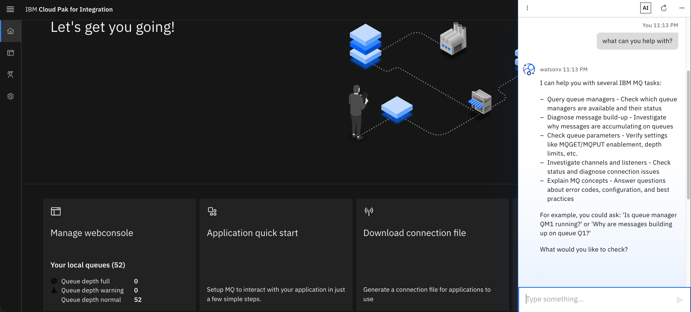
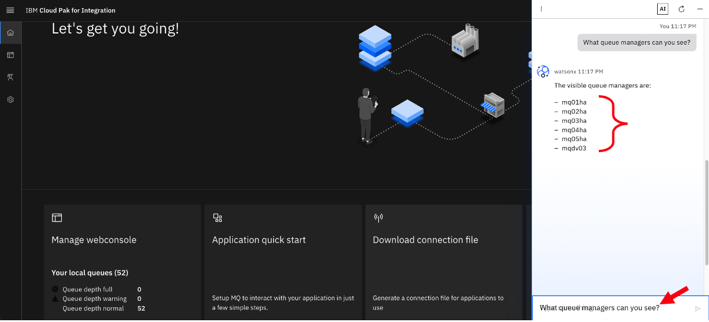
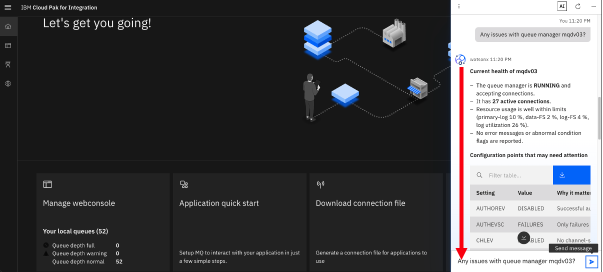
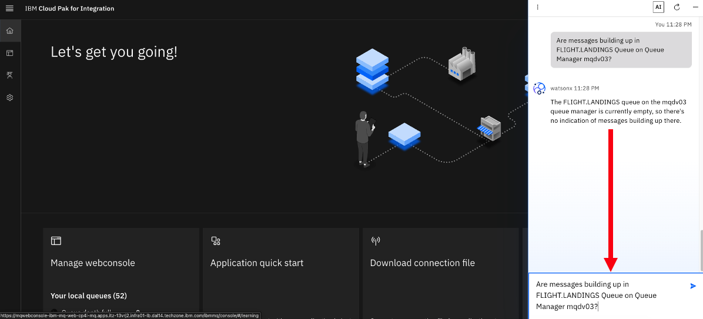

# IBM MQ AI Agent lab

---

# Table of Contents

- [1. Overview](#overview)
- [2. Accessing IBM MQ WebConsole ](#webconsole)
- [3. Sample prompts](#prompts)
- [4. Summary ](#summary)

---

## 1. Overview 

In this lab, you will explore IBM MQ AI Agent capabilities. 

**What is MQ AI Agent?** 
The IBM MQ Agent is an AI-powered conversational assistant designed to help administrators explore configurations, monitor object status, and troubleshoot messaging issues across IBM MQ networks using natural language.  

**Key Capabilities and Features**  
- Natural-Language Diagnostics: 
Translates plain-English questions into insights about queue states, channel health, and message backlogs.
- Read-Only Safety: Designed with strict read-only access to query and reason about queue manager states without running modifying commands (like MQSC).
- Model Context Protocol (MCP): Uses an MCP server backend to host diagnostic tools that fetch live structural and runtime data from up to twenty connected queue managers.
- Containerized Architecture: Runs on Kubernetes environments such as Red Hat OpenShift or Amazon EKS, integrated via the IBM MQ Console.
- Flexible Inferencing: Supports foundational models via IBM watsonx.ai as well as vLLM-based local or managed endpoints

 

**High Level MQ AI Agent Topology**  

 

## 2. Accessing IBM MQ WebConsole 

Login to IBM Cloud Pak for Integration's Platform Navigator using the URL Provided.  

Filter the capabilities by searching for **cp4i-mq** then click on **mqwebconsole** to open IBM MQ WebConsole.  

Click on **Open chat window**, the IBM MQ AI Assistent icon.  

A chat window will as below.  

## 3. Sample prompts 

Run some sample prompts:  

1. What can you help with?

  Response:  
  

2. What queue managers can you see?

3. Any issues with queue manager mqdv03?

4. Are messages building up in FLIGHT.LANDINGS Queue on Queue Manager mqdv03?

5. Is there a problem with dead letter queue on mqdv03  
** **Note:** Answer will be bit vague, if DLQ is not defined.

6. Do any queues have producers?

7. how do i define a local queue?

8. What are the versions the queue managers?

9. is there any message build up in queue manager mqdv03?

10.	What is the problem with APPQ on mqdv03?

11.	Diagnose APPQ on mqdv03

12. What is the name of dead letter queue for mqdv03? 

13. When was the last message received from amqsphac on APPQ1?

14. what applications are connected to cp4i-mq-mq01ha queue manager?

15. What queues are currently active?

16. Show APPQ current depth?

17. What applications are writing messages to APPQ?

18. Is APPQ under mqdv03 queue manager full?

Channels:  
19. Are any channels in Retrying state on mqdv03 queue manager?

20. What applications are connecting to channel SB.SVRCONN on mqdv03 queue manager?

 

## 4. Summary 

Congratulations, you have explored IBM MQ Agent and performed health checks of MQ Queue Managers and the objects by issuing  prompts.  
