# IBM App Connect AI Agent lab

---

# Table of Contents

- [1. Overview](#overview)
- [2. IBM AppConnect Dashboard ](#ace-dashboard)
- [3. Sample prompts](#prompts)
- [4. Summary ](#summary)

---

## 1. Overview 

In this lab, you will explore IBM App Connect Enterprise AI Agent capabilities from the IBM App Connect Dashboard.   

**What is IBM App Connect Enterprise AI Agent?** 

The IBM App Connect Enterprise AI agent is an intelligent assistant built into IBM App Connect Enterprise (ACE) that helps teams manage, monitor, and connect enterprise integrations using natural language.

**Key Capabilities and Features**  

  - **Topology and Health Monitoring**  
    Instantly lists active or stopped integration runtimes, checks operational health status, and summarizes container environments without requiring command lines.
  - **Flow and Resource Inspection**  
    Inspects deployed message flows, surfaces dependencies, tracks policy requirements, and identifies deprecated components
  - **Deployment and Knowledge Guidance**  
    Provides actionable instructions for configuration changes across runtimes and queries pre-trained IBM knowledge bases for troubleshooting.
  - **Model Context Protocol (MCP) Integration**   
    Uses the Model Context Protocol to turn existing APIs and connector actions into tools that external AI agents (like enterprise LLMs) can discover and invoke securely using everyday language

 
<!--
**High Level MQ AI Agent Topology**  

-->
 

## 2. IBM AppConnect Dashboard 

Follow below steps to ppen **IBM App Connect Dashboard**:  

Login to IBM Cloud Pak for Integration's Platform Navigator using the URL Provided.  

Right click on **ace-dashboard**, and click on **"Open Link in a New tab"**.  

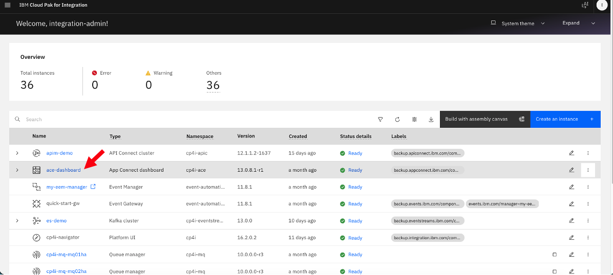

Click on **Open chat window**, the IBM MQ AI Assistent icon.  
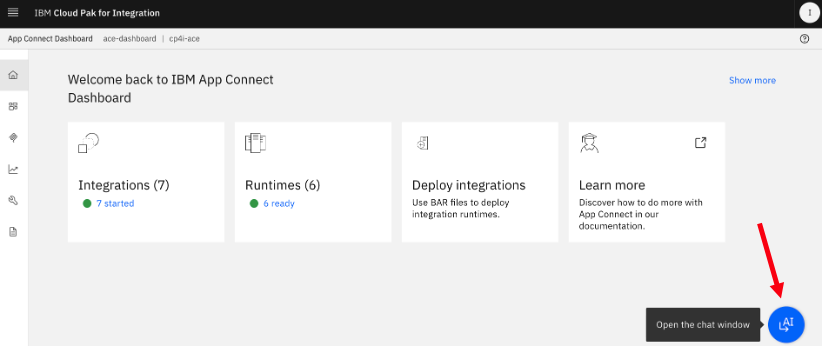

Accept the Disclaimer (if you see one).  
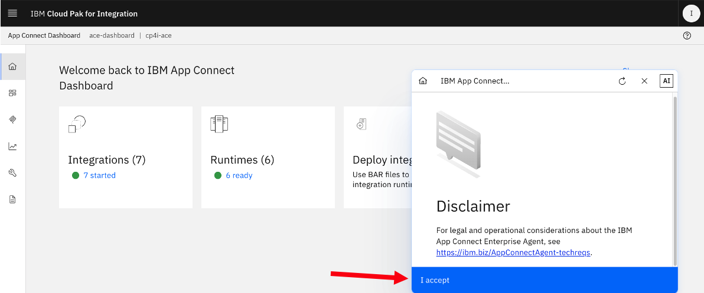

A chat window will appear as below.  
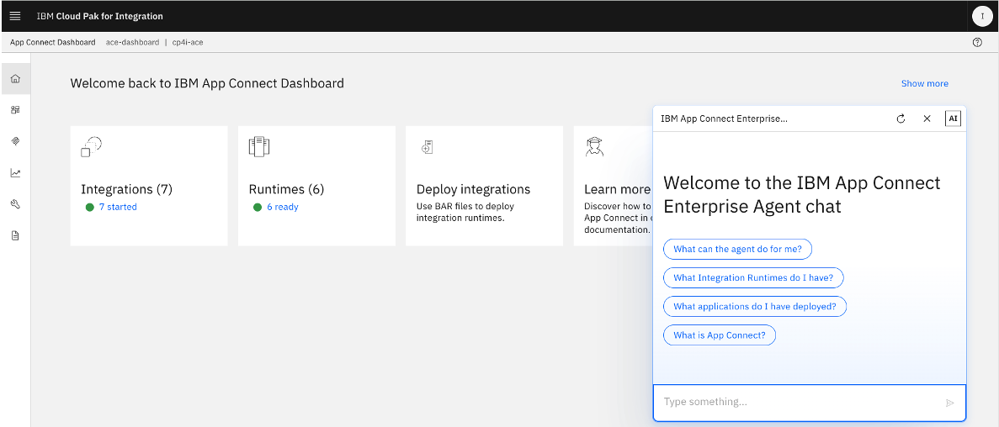

## 3. Sample prompts 

Run some sample prompts:  

1. What can the agent do for me?

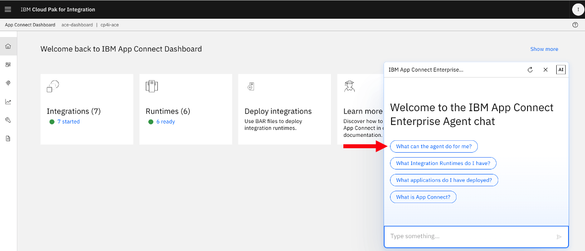

  Response:  
  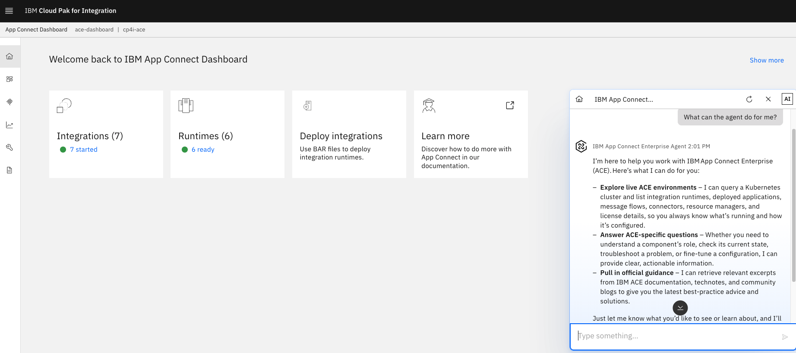

2. Show me list of integration runtimes
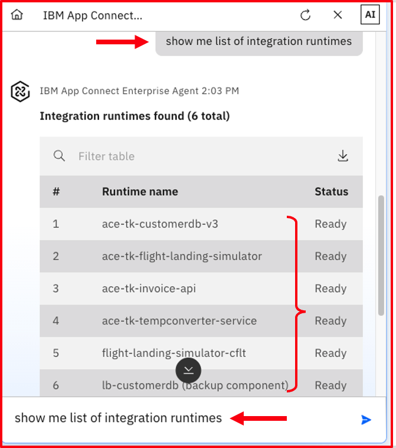

3. List the message flows under ace-tk-customerdb-v3 runtime
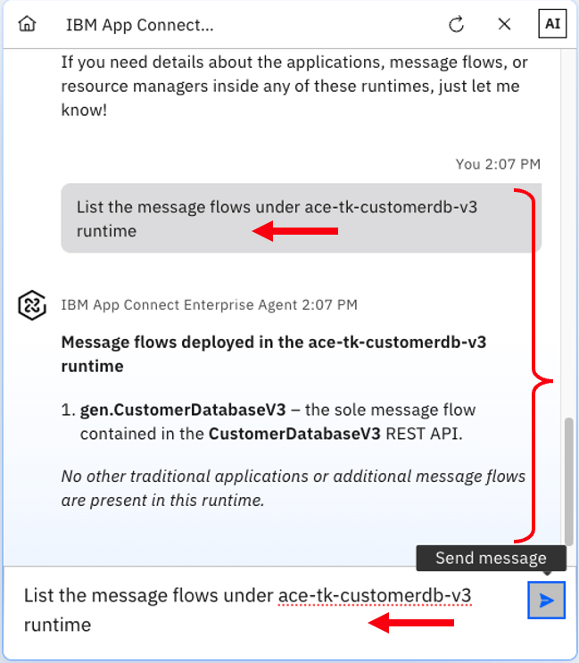

4. Explain gen.CustomerDatabaseV3 message flow
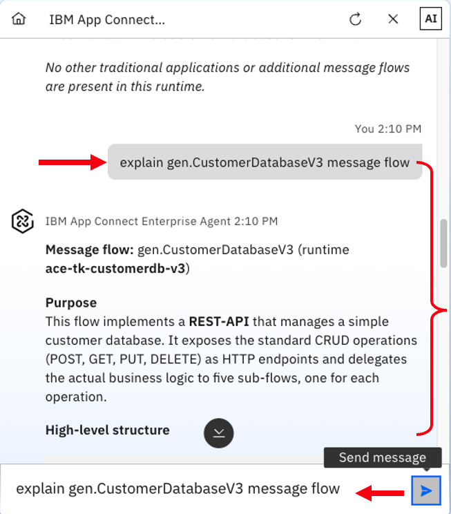

You can see more details if you scroll down in th chat window.  
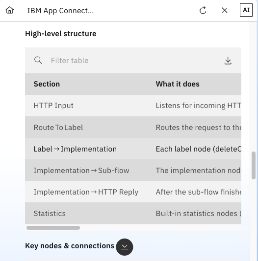

5. Are all the message flows are running?
This may take bit longer than the previous prompts, but you should see response.  
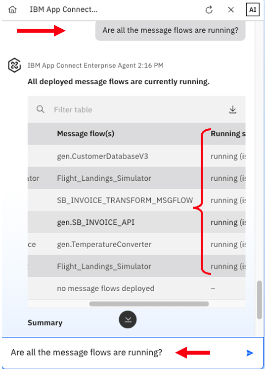

5. What is IBM App Connect?

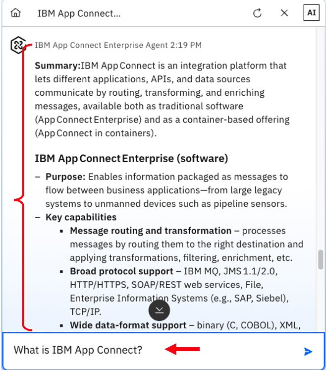

6.  Similarly, run more prompts to explore the capabilities of App Connect AI Agent.  

 

## 4. Summary 

Congratulations, you have explored IBM App Connect AI Agent and performed health checks of App Connect Deployments and the objects by issuing Natural Language Prompts.  
