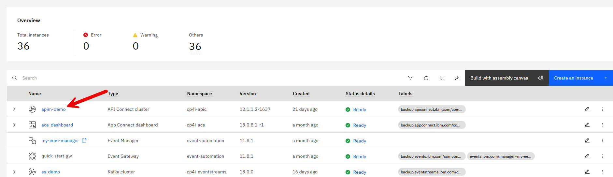
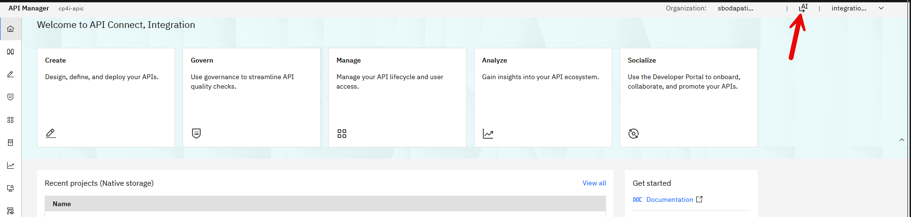
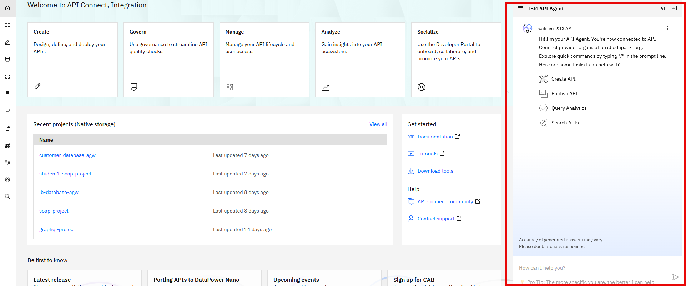
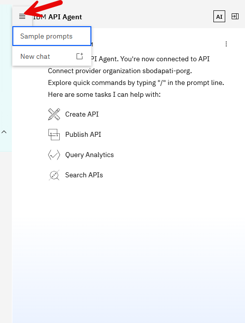
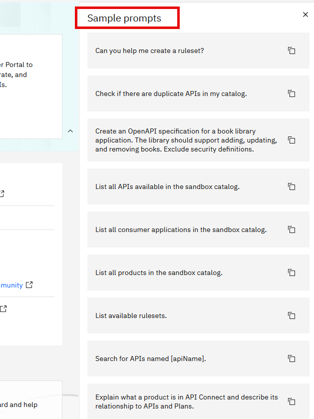
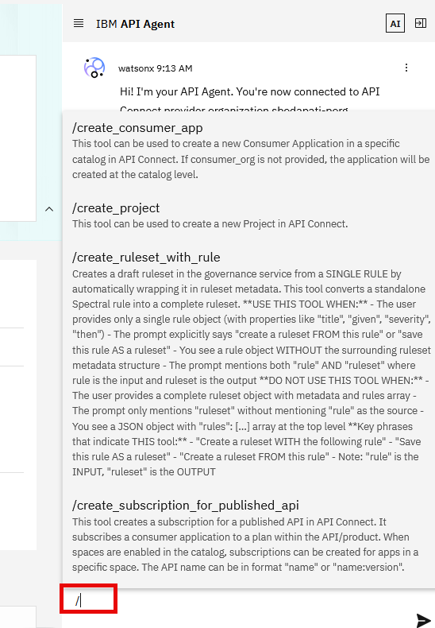
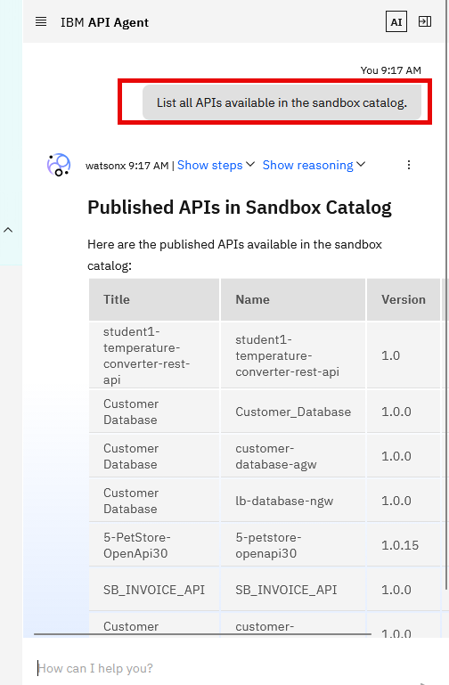

# IBM API Connect AI Agent lab

---

# Table of Contents

- [1. Overview](#overview)
- [2. IBM AppConnect Dashboard ](#ace-dashboard)
- [3. Sample prompts](#prompts)
- [4. Summary ](#summary)

---

## 1. Overview 

In this lab, you will explore IBM API Connect AI Agent capabilities from the IBM API Connect Dashboard.   

**What is IBM API Connect Enterprise AI Agent?** 

The IBM API Connect Enterprise AI Agent (API Agent) is an intelligent assistant built into IBM API Connect that helps developers design, govern, test, publish, and manage APIs using natural language. Powered by watsonx.ai and built on an agentic framework, it automates key tasks across the API lifecycle, including API creation, documentation, governance validation, testing, and deployment, enabling teams to deliver AI-ready APIs faster while maintaining enterprise standards and security.

**Key Capabilities and Features**  

  - **Natural language API development:**  
    Describe an API requirement in plain English and the agent can generate OpenAPI specifications, documentation, and mock responses.
  - **API discovery and reuse:**  
    Searches existing API catalogs to identify reusable APIs and reduce API sprawl.
  - **Governance and compliance:**  
    Validates APIs against organizational standards and can automatically remediate governance issues.
  - **Automated testing:**  
    Generates and executes API test cases based on API semantics and expected behavior.
  - **Code-first and design-first support:**  
    Works with both development approaches and can help generate backend application code and deployments.
  - **Conversational experience:**  
    Uses a chat-based interface to plan, execute, and explain actions while requiring approval for system-changing operations.

 
<!--
**High Level MQ AI Agent Topology**  

-->
 

## 2. IBM API Connect Dashboard 

Follow below steps to open **IBM API Connect Dashboard**:  

Login to IBM Cloud Pak for Integration's Platform Navigator using the URL Provided.  

Right click on **apim-demo*, and click on **"Open Link in a New tab"**.  

Click on **AI**, in the upper right corner to open the API Assistant chat window.  

A chat window will appear as below.  

## 3. Sample prompts 

1. First lets explore some of the Sample prompts.   Click on the **hamburger icon**

You will see a list of Sample Prompts you can run.  

  Response:  
  

2. Show me list of integration runtimes

5.  Similarly, run more prompts to explore the capabilities of API Connect AI Agent.  

 

## 4. Summary 

Congratulations, you have explored IBM API Connect AI Agent and performed health checks of API Connect Deployments and the objects by issuing Natural Language Prompts.  
