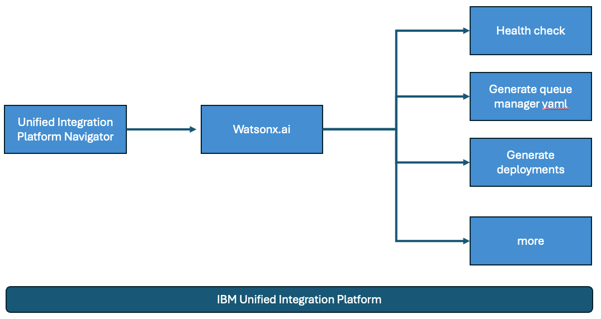
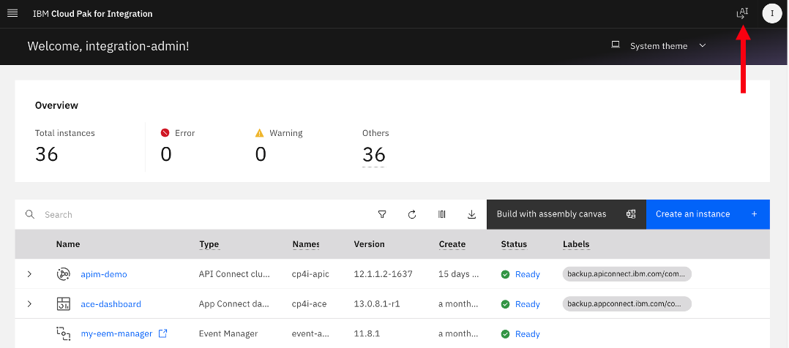
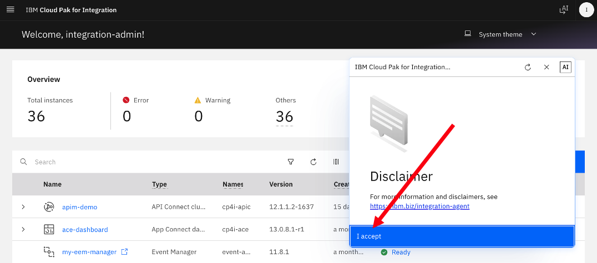
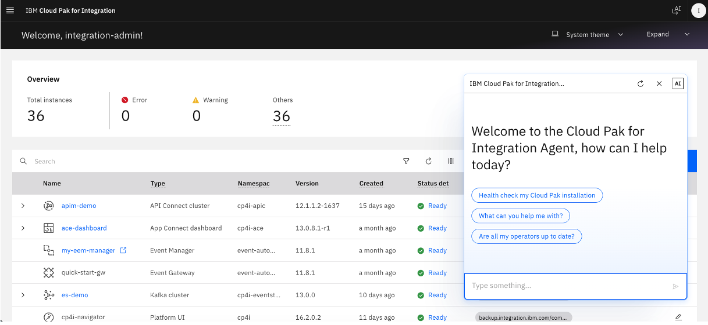
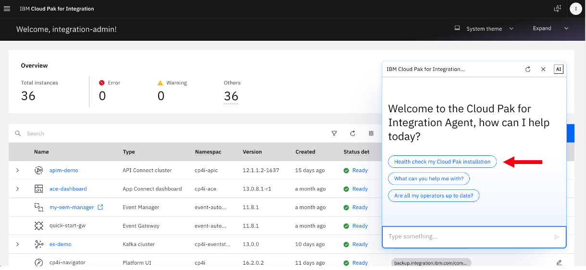
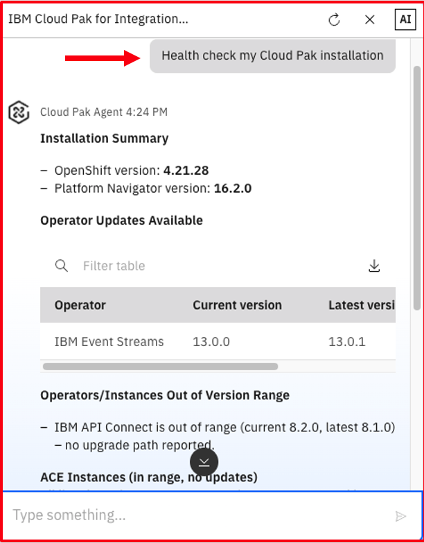
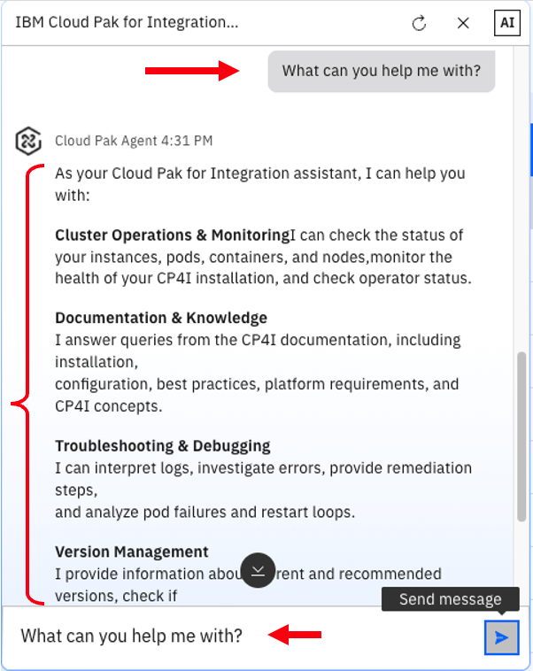
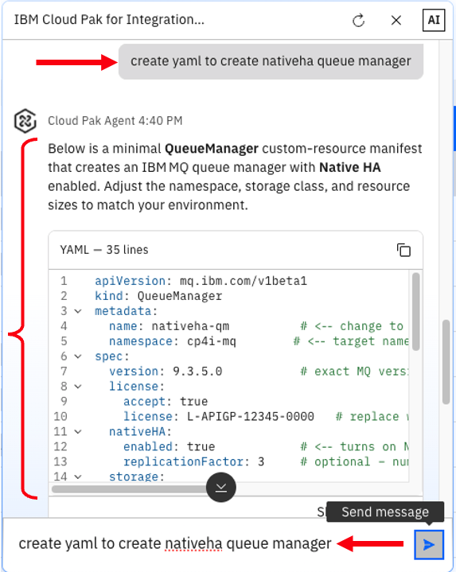

# IBM Integration Platform AI Agent lab

---

# Table of Contents

- [1. Overview](#overview)
- [2. IBM Unified Integration Platform Navigator](#int-platform)
- [3. Sample prompts](#prompts)
- [4. Summary ](#summary)

---

## 1. Overview 

In this lab, you will explore IBM Integration Platform AI Agent Capabilities.  

**What is IBM Integration Platform AI Agent?** 
IBM Integration AI Agent is a conversational, AI-powered feature in the Platform UI that helps administrators diagnose, monitor, and troubleshoot hybrid integration environments using natural language queries.  

**Core Components & Specialized Agents**  
The system uses a unified Supervisor Agent that coordinates multiple specialized background agents:.  

- **Knowledge Agent**
Queries official documentation, product guides, and support content to provide personalized guidance.
- **Log Agent**  
Scans and analyzes component logs for warnings and errors.
- **Topology Agent**
Maps out how software instances relate to Kubernetes objects and resources.
- **Instance Agent**
Checks and reports on the operational health and status of deployed instances and containers.
- **Versions and Updates Agent**
Proactively checks component currency and available software fixes.

**Key Benefits**  
- **Faster Troubleshooting**
Cuts down time spent manually searching raw log files and complex documentation.
- **Lower Barrier to Entry**
Helps teams manage Kubernetes and integration topologies without requiring deep specialist expertise.
- **Maintains Human Control**
Acts as a guided assistant while leaving administrators fully responsible for final decisions and execution

 

**High Level Integration AI Agent Topology**  

 

## 2. IBM Unified Integration Platform Navigator 

Login to IBM Cloud Pak for Integration's Platform Navigator using the URL Provided, and click on the **AI** icon on the top right of the screen.  

Accept the Disclaimer if you see one.  

A chat window should be opened.  

  

## 3. Sample prompts 

Run some sample prompts:  

1. Click on **"Health check my Cloud Pak for installation**.  

You should see details about the installation, and recommendations as you can see below that a newer Operator is available.  

2. What can you help me with?  

3. Create yaml to create nativeha queue manager?  

 

4. Similarly, run additional prompts  
 

## 4. Summary 

Congratulations, you have explored IBM MQ Agent and performed health checks of MQ Queue Managers and the objects by issuing  prompts.  
